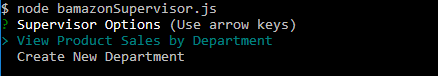

# Bamazon: Node.js/MySQL Application Storefront

### Overview
This CLI application is an Amazon-like storefront that has 3 user options: Customer, Manager, and Supervisor. The application takes in orders from customers and depletes the store's inventory. Additional functions of the application include adding new products to the store, adding inventory to existing products, tracking product sales across the store's departments, and providing a summary of the departments' total profit.

The npm packages used in this application are MySQL, Inquirer, and CLI-table.

- - -

### Customer View

To access the Customer interface, use `$ node bamazonCustomer.js` and the following table will display:

The table shows what products are part of the store's inventory and includes information for the Item ID number, product name, department name, and the price per unit.

### Customer Prompts

Below is an example of the prompting scheme for the customer interface:

The user will enter the Item ID number of the product they want to purchase. Validation rules ensure that the user is only able to enter numbers, which is restricted to the range of values set by the number of items available in the store. Then the user will enter the number of items they want to purchase. 

If there are enough products in stock, then the application will fulfill the customer's request and display a confirmation message. The quantity is deducted from the MySQL database and the puchase cost is added to a running total profit for that item.

If there are _not_ enough products in stock, then the application will display to the customer that the order could not be processed. The application will not alter the MySQL database.

After each transaction, the customer is prompted for whether or not they want to continue shopping. Once the customer is done shopping, then the application will display a message that the shopping is complete.

- - -

### Manager View

To access the Manager interface, use `$ node bamazonManager.js` and the following prompt will display:

The application prompts the user with a list of actions, which include View Products for Sale, View Low Inventory, Add to Inventory, and Add New Product. The following screenshots show the prompting scheme for the Manager options.

#### View Products for Sale

The "View Products for Sale" option allows the user to see a list of all the products that are in the store database and the inventory for each of those products.

#### View Low Inventory

The "View Low Inventory" option displays a list of products that have an inventory of less than 5 in stock.

#### Add to Inventory

The "Add to Inventory" option allows the user to add inventory to a product in the store. The screenshot below is an example of adding inventory with a follow-up table of the products to show that the inventory was added correctly.

#### Add New Product

The "Add New Product" option allows the user to add a new product to the store. The screenshot below is an example of adding a new product with a follow-up table of the products to show that the new product was added correctly.

After each action, the manager is prompted for whether or not they want to perform another task. Once the manager is done, then the application will display a message that all tasks are complete.

- - -

### Supervisor View

To access the Supervisor interface, use `$ node bamazonSupervisor.js` and the following prompt will display:

The application prompts the user with a list of actions, which include View Products for Sale by Department and Create New Department. The following screenshots show the prompting scheme for the Supervisor options.

#### View Product Sales by Department

The "View Product Sales by Department" option displays a table summarizing the profit for each department. The total profit for each department is calculated by subtracting Product Sales from Overhead Costs.

#### Create New Department

The "Create New Department" option allows the user to add a new department to the store. The screenshot below shows the prompts for creating a new department.

After each action, the supervisor is prompted for whether or not they want to perform another task. Once the supervisor is done, then the application will display a message that all tasks are complete.